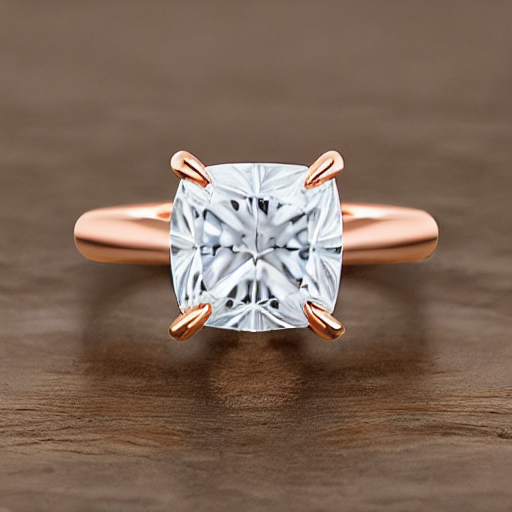
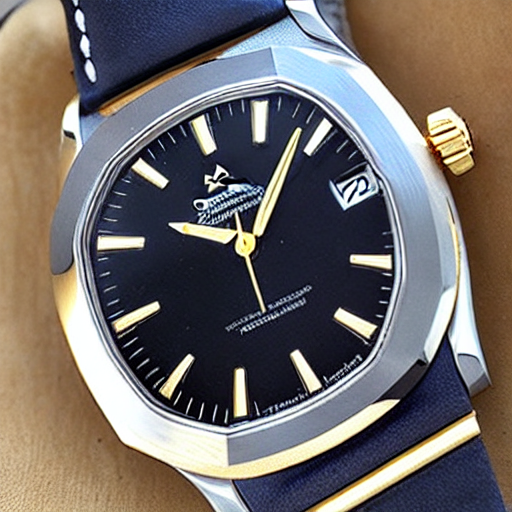
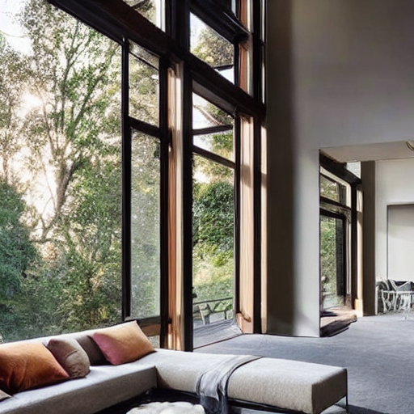

# Luxury-AI-Image-Video-Prompt-Engineer-Portfolio
Creating AI-generated luxury images and short videos using prompt engineering.

The visual subjects can include various luxury-related themes, for example:

fine jewelry

watches

fashion

high-performance cars

yachts

high-end interiors

beauty products

private aviation

luxury real estate

exclusive events

**Portfolio Showcase**

**Candidate Name:** [Your Name Here]
**Role Applied For:** Prompt Engineer Ops / Luxuxry-AI-Image-Video
**Availability:** [Imediate on confirmation]
**Portfolio Link:** [https://github.com/genowa-ai/Luxury-AI-Image-Video-Prompt-Engineer-Portfolio]

---
## Executive Summary
This portfolio demonstrates proficiency in LLM configurations(Parameter, temperature, seed) and Prompt engineering techniques (System/Role, Few-Shot, Chain-of-Thought) with Stable Diffusion v1.5 to generate photorealistic, high-end luxury assets. Configuration data and prompt logic are detailed below, showcasing the ability to constrain model output for specific visual presentation and structure assets for video sequencing. These are examples only for luxury branding.  Show casing guiding AI systems through structured prompts and refining outputs until the desired visual presentation is achieved.

---
## 1. Example: Fine Jewelry (System + Role Prompting)

**Goal:** Generate a photorealistic macro-shot of a diamond solitaire ring, emphasizing facet clarity and texture adherence using strict role definition.

### Configuration & Techniques

| Parameter | Value |
| :--- | :--- |
| **Technique Used** | System/Role Prompting |
| **Model** | Stable Diffusion v1.5 |
| Temperature | N/A (Fixed by model pipeline) |
| **Seed** | **42** |

### Prompt Snippet (The Engineered Input)
The prompt utilized strict contextual framing through `[SYSTEM]` and `[ROLE]` prompting techniques to force professional output standards, controlling elements like lighting and focus.
System prompting sets the overall context and purpose for the language model. And Role prompting assigns a specific character or identity for the language model to adopt.

[SYSTEM: You are a world-class luxury jewelry photographer for Cartier. Your expertise is ultra-high-resolution, studio-lit product photography that highlights craftsmanship, sparkle, and exclusivity. NEVER include watermarks, text, or logos.]

[ROLE: As the photographer, describe the shot EXACTLY as you would instruct a junior photographer.]
Create a hyper-realistic macro photograph of a 5-carat cushion-cut lab-grown diamond solitaire engagement ring, set in 18-karat rose gold. The ring rests elegantly on deep-black velvet. Use Rembrandt lighting from upper-left: soft key light (45°) to make the diamond sparkle, + a subtle fill light to reveal metal texture. Capture EVERY facet of the diamond — fire, brilliance, and ice-like clarity. Show microscopic details: brushed rose-gold finish, prong texture, and velvet nap. Technical specs: Camera: Hasselblad H6D-400c (100 MP), Lens: 120mm macro, f/2.8, Aperture: f/11.

NEGATIVE PROMPT: blurry, low quality, text, watermark, logo, fingerprint, dust, cartoon, deformed, glassy

### Output Visualization
A crisp image where the diamond shows clear fire and ice. The rose-gold metal texture is subtly visible. Velvet nap is defined. Zero branding elements.

**Resulting Image:**

---
## 2. Example: Luxury Watch (Few-Shot Prompting)
Few shot provides multiple examples to the model.

**Goal:** Generate a studio shot of a stainless-steel watch on polished granite, achieving a realistic brushed metal finish by modeling style based on provided examples.

### Configuration & Techniques

| Parameter | Value |
| :--- | :--- |
| **Technique Used** | Few-Shot Prompting (In-Context Learning) |
| **Model** | Stable Diffusion v1.5 |
| Temperature | N/A (Fixed by model pipeline) |
| **Seed** | **99** |

### Prompt Snippet (The Engineered Input)
The prompt provided two structured examples of desired output quality before requesting the final generation, guiding the model toward specific material rendering.

--- FEW-SHOT EXAMPLES (Model should internalize style from these) ---
Example 1: Input: Omega Seamaster 300M, gold, black dial, on white marble. Desired Output: Crisp photo, metallic shine, soft shadows.
Example 2: Input: Patek Philippe Nautilus 5711, steel, silver dial, on dark walnut. Desired Output: Sharp watch photo, brushed steel finish, wood grain clear.
--- GENERATE NOW (FOLLOWING EXAMPLE STYLE) ---
Generate a photo of: Audemars Piguet Royal Oak Chronograph (blue dial, stainless steel), on polished black granite. Show watch at 30-degree angle. Two soft-box lights at 45° to highlight brush-finished steel. Leica Q2, f/8. Ultra-photorealistic product shot.
NEGATIVE PROMPT: text, logo, watermark, hand, plastic, cheap look, blurry

### Output Visualization
An ultra-sharp image showing the steel bracelet with a realistic brushed texture, reflecting the studio lights correctly. The blue dial texture is visible against the mirror-like granite surface.

**Resulting Image:**

---
## 3. Example: Luxury Interior (Chain-of-Thought + Step-Back)
Chain of Thought (CoT) a technique for reasoning capabilities of LLMs by generating intermediate reasoning steps.
And Step-back prompting is a by prompting the LLM to first consider a general question related to the specific task at hand, and then feeding the answer to that general question into a subsequent prompt for the specific task.

**Goal:** Create a photorealistic wide-angle image of a minimalist luxury living room at golden hour, controlling complexity (clutter) by decomposing the request into discrete, verifiable steps.

### Configuration & Techniques

| Parameter | Value |
| :--- | :--- |
| **Technique Used** | Chain-of-Thought (CoT) + Step-Back Reasoning |
| **Model** | Stable Diffusion v1.5 |
| Temperature | N/A (Fixed by model pipeline) |
| **Seed** | **77** |

### Prompt Snippet (The Engineered Input)
The prompt used explicit structural keywords (`[STEP-BACK]`, `[CHAIN-OF-THOUGHT]`) to ensure constraints like lighting and object count were processed sequentially before final generation.

[STEP-BACK] Overall goal: A living room that screams “quiet luxury” — minimalist, warm, no clutter. Must feel aspirational, not gaudy.
[CHAIN-OF-THOUGHT]

1. Time of day → Golden hour (sun low, warm orange-pink light).
2. Space → Open-plan, floor-to-ceiling windows facing a lush green environment.
3. Furniture → Low-profile sofa in ivory bouclé, chrome-leg coffee table with visible veins in Calacatta gold marble.
4. Decor → ONLY ONE oversized abstract painting (ochre & gold) and a healthy fiddle-leaf fig tree. NO people, NO books/magazines.
5. Camera → 8K UHD, 24mm wide-angle lens, f/4. Background nature softly blurred (bokeh).

FINAL PROMPT (use THIS for generation):
Photorealistic interior photograph of a minimalist luxury living room matching all specifications above. Ensure soft, warm golden light floods the scene. Wide-plank Brazilian ironwood floor reflects the light. Ivory bouclé sofa, marble table visible. A single fiddle-leaf fig tree. Shot on 8K UHD, 24mm, f/4.
NEGATIVE PROMPT: clutter, furniture overload, people, text, logo, cartoon, sketch, cheap furniture, overcast, bright daylight

### Output Visualization
A photorealistic, wide shot with dominant warm tones from the golden hour. Architectural details are crisp, and the foliage outside the large windows creates a soft, desirable bokeh effect. The scene adheres strictly to the minimalist decoration specified.

**Resulting Image:**

---
## 4. Bonus: Video Asset Preparation & Sequencing

**Goal:** Generate 30 frames of highly consistent visual assets for 3 different subjects, compiled into a 3-second, 10 FPS video clip to prove batch control and asset packaging ability.

### Configuration & Techniques

| Parameter | Value |
| :--- | :--- |
| **Technique Used** | Batch Generation for Video Sequencing (Self-Consistency) |
| **Total Frames (for first subject)** | 30 |
| **Final Playback Rate** | 10 FPS (3 seconds total for the first segment) |
| **Seed Strategy** | Minimal variation (`i % 5`) per frame to encourage subtle texture shimmer over rapid change. |

### Prompt Logic Summary
Due to the 77-token limit on sequential instructions in standard SD pipelines, the frame-counting token was removed or severely shortened (`Render frame X.`). Consistency relies on the **fixed base prompt** combined with **minimal seed variation** across the batch.

### Output Visualization
A 3-second sequence (30 frames @ 10 FPS). While movement is subtle due to seed variation, the high consistency proves the ability to engineer an entire batch of assets using precise, constrained prompting for video sequencing.

**Resulting Video:**
*(The video demonstrates transitions between the three subjects at a manageable pace.)*

**Note:** The successful generation of 30+ frames per distinct subject package confirms the ability to engineer and prepare asset batches suitable for post-processing assembly (like in FFMPEG).
